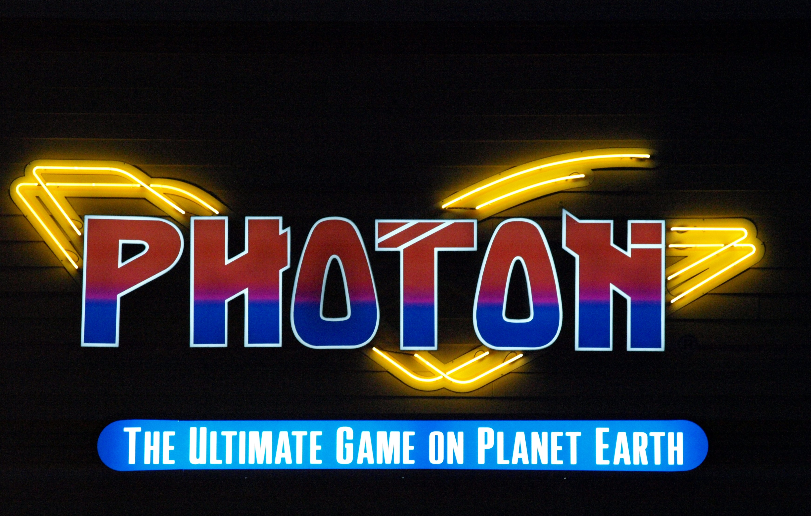

<a id="readme-top"></a>
<details>
  <summary>Table of Contents</summary>
  <ol>
    <li>
      <a href="#about">About The Project</a>
      <ul>
        <li><a href="#built-with">Built With</a></li>
        <li><a href="#features">Features</a></li>
      </ul>
    </li>
    <li>
      <a href="#getting-started">Getting Started</a>
      <ul>
        <li><a href="#requirements">Requirements</a></li>
        <li><a href="#installation">Installation</a></li>
      </ul>
    </li>
    <li>
      <a href="#usage">Usage</a>
      <ul>
        <li><a href="#player-entry-interface">Player Entry Interface</a></li>
        <li><a href="#udp-communication">UDP Communication</a></li>
      </ul>
    </li>
    <li><a href="#project-structure">Project Structure</a></li>
    <li><a href="#contributors">Contributors</a></li>
    <li><a href="#additional-notes">Additional Notes</a></li>
    <li><a href="#license">License</a></li>
  </ol>
</details>


<br />
<div align="center">
  <a href="https://github.com/maddydou/SE">
    
  </a>

# Laser Tag Game Interface
</div>

## About

This project provides an interface for a laser tag game, allowing users to enter player information for two teams and then transition to the game progress (play action) screen.

<p align="right">(<a href="#readme-top">back to top</a>)</p>


### Built with

* 
* 
* 
* 


### Features

- **Player Input Screen:**
  - Two teams: Red and Green.
  - Enter player IDs; the corresponding player codename is automatically retrieved from a PostgreSQL database.
  - Use the **Tab** key to move between input fields.
  
- **Keyboard Shortcuts:**
  - **F3**: Validates that each team has at least one player and then moves to the play action screen.
  - **F12**: Clears all player input fields.
  - **F7**: Quits the game interface.

- **Play Action Screen:**
  - Opens as a new window when F3 is pressed (provided that both teams have at least one player).
  - Acts as a placeholder for further game progress functionality (to be developed by another team member).
 
### UDP Communication:
- **`python_udpclient.py`**: UDP client to simulate equipment code transmissions and network commands.
- **`python_udpserver.py`**: UDP server that listens for messages and responds (simulating game state communication).

<p align="right">(<a href="#readme-top">back to top</a>)</p>

## Getting Started

### Requirements

- **Python 3.x**
- **Tkinter:** Usually included with Python installations.
- **Pillow:** For image handling
- **Psycopg2:** PostgreSQL adapter for Python.
- **PostgreSQL**

### Installation

1. Clone the repo
   ```sh
   git clone https://github.com/maddydou/SE.git
   cd SE
   ```
2. Ensure login details in player_entry.py are correctly configured (Should be fine on Photon VM)
3. Ensure dependencies are installed
   ```sh
   pip install psycopg2-binary Pillow

<p align="right">(<a href="#readme-top">back to top</a>)</p>

## Usage

### Player Entry Interface

Run the main application 
```sh
python3 player_entry.py
```

### UDP Communication
Open two separate terminal windows
* Start UDP Server in one window
  ```sh
  python3 python_udpserver.py
  ```
* Start UDP Client in other window
  ```sh
  python3 python_udpclient.py
  ```
* Follow the promots in the UDP client to send equipment codes or control to the program.

### Database

Create a database named photon with a table called players having at least the following columns: 
```sh
sql CREATE TABLE players ( id INTEGER PRIMARY KEY, codename TEXT );
```
Optionally, insert a test record: 
```sh
sql INSERT INTO players (id, codename) VALUES (1, 'Opus');
```

<p align="right">(<a href="#readme-top">back to top</a>)</p>

## Project Structure

- **`player_entry.py`**: Contains the splash screen and the player entry GUI. It integrates database operations (retrieving, adding, and updating players) and provides the main interface for entering player data.
- **`python_udpclient.py`**: Implements a UDP client that sends messages (equipment codes) to the server and supports commands for starting/stopping the game and switching networks.
- **`python_udpserver.py`**: Implements a UDP server that listens for incoming messages and simulates game state responses.
- **`background.png`**: Background image used for the player entry screen.
- **`logo.jpg`**: Logo image displayed on the splash screen.
- **`README.md`**: This file.

<p align="right">(<a href="#readme-top">back to top</a>)</p>

## Contributors

| Contributor      | Username      |
| ---------------- | ------------- |
| Adam Montano     | adam4475      |
| Zebulun Jenkins  | zubEjankins   |
| Madison Dou      | maddydou      |
| Chase Haskell    | chase-haskell |
| Joey Leder       | JoeyLeder     |

<p align="right">(<a href="#readme-top">back to top</a>)</p>

## Additional Notes

- The project demonstrates full CRUD operations on the `players` table:
  - Retrieving player information.
  - Adding a new player when a player ID is not found.
  - Updating an existing player's codename.
- The UDP modules simulate equipment code transmissions and can be extended for full game integration.
- The code is modular to facilitate collaboration among team members.
- For any issues or further enhancements, please refer to our Slack channel or contact the team.

<p align="right">(<a href="#readme-top">back to top</a>)</p>

## License

This project is licensed under the MIT License.

**Repository:** [GitHub Link](https://github.com/maddydou/SE)

<p align="right">(<a href="#readme-top">back to top</a>)</p>

<br />
<div align="center">
  <a href="https://github.com/maddydou/SE">
    
  </a>
</div>
